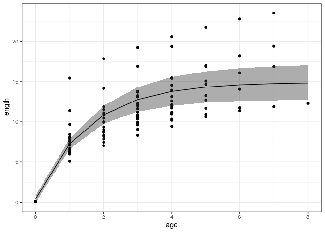

-   [fishgrowbot: Fish growth curves through back-calculation of
    otoliths rings in a Bayesian
    framework](#fishgrowbot-fish-growth-curves-through-back-calculation-of-otoliths-rings-in-a-bayesian-framework)
-   [Installing and loading
    fishgrowbot](#installing-and-loading-fishgrowbot)
-   [Use](#use)
-   [Citation](#citation)
-   [References](#references)

<!-- badges: start -->

[](https://travis-ci.org/nschiett/fishgrowbot)
[](https://github.com/nschiett/fishgrowbot/actions)
<!-- badges: end -->


fishgrowbot: Fish growth curves through back-calculation of otoliths rings in a Bayesian framework
==================================================================================================

The `fishgrowbot` package provides a tool to conduct back-calculation
based on otolith readings and fit the Von Bertalanffy growth curve with
a hierarchical structure, both in a Bayesian framework.

Installing and loading fishgrowbot
==================================

`fishgrowbot` uses Markov Chain Monte Carlo simulations provided by
[stan](https://github.com/stan-dev/rstan/wiki/RStan-Getting-Started).
Therefore, the first step is to install
[stan](https://github.com/stan-dev/rstan/wiki/RStan-Getting-Started).

### GitHub

The best way to install the latest version of `fishgrowbot` is to
install it from GitHub.

    ## Installing package into '/Users/runner/work/_temp/Library'
    ## (as 'lib' is unspecified)

    ## also installing the dependencies 'utf8', 'pillar', 'pkgconfig', 'vctrs', 'BH', 'sys', 'ini', 'tibble', 'lazyeval', 'later', 'askpass', 'diffobj', 'clipr', 'crayon', 'curl', 'fs', 'gh', 'git2r', 'purrr', 'rematch2', 'rprojroot', 'whisker', 'processx', 'R6', 'assertthat', 'fansi', 'rex', 'htmlwidgets', 'crosstalk', 'promises', 'openssl', 'prettyunits', 'xopen', 'brew', 'commonmark', 'Rcpp', 'xml2', 'brio', 'lifecycle', 'praise', 'ps', 'waldo', 'usethis', 'callr', 'cli', 'covr', 'desc', 'DT', 'ellipsis', 'httr', 'memoise', 'pkgbuild', 'pkgload', 'rcmdcheck', 'remotes', 'roxygen2', 'rstudioapi', 'rversions', 'sessioninfo', 'testthat', 'withr'

    ## 
    ##   There is a binary version available but the source version is later:
    ##       binary source needs_compilation
    ## vctrs  0.3.4  0.3.5              TRUE
    ## 
    ## 
    ## The downloaded binary packages are in
    ##  /var/folders/24/8k48jl6d249_n_qfxwsl6xvm0000gn/T//Rtmp7OjLRP/downloaded_packages

    ## installing the source package 'vctrs'

    ## Using bundled GitHub PAT. Please add your own PAT to the env var `GITHUB_PAT`

    ## Downloading GitHub repo nschiett/fishgrowbot@HEAD

    ## backports    (NA -> 1.2.0    ) [CRAN]
    ## matrixStats  (NA -> 0.57.0   ) [CRAN]
    ## checkmate    (NA -> 2.0.0    ) [CRAN]
    ## gtable       (NA -> 0.3.0    ) [CRAN]
    ## colorspace   (NA -> 2.0-0    ) [CRAN]
    ## viridisLite  (NA -> 0.3.0    ) [CRAN]
    ## RColorBrewer (NA -> 1.1-2    ) [CRAN]
    ## munsell      (NA -> 0.5.0    ) [CRAN]
    ## labeling     (NA -> 0.4.2    ) [CRAN]
    ## farver       (NA -> 2.0.3    ) [CRAN]
    ## scales       (NA -> 1.1.1    ) [CRAN]
    ## isoband      (NA -> 0.2.2    ) [CRAN]
    ## RcppEigen    (NA -> 0.3.3.7.0) [CRAN]
    ## RcppParallel (NA -> 5.0.2    ) [CRAN]
    ## V8           (NA -> 3.4.0    ) [CRAN]
    ## loo          (NA -> 2.3.1    ) [CRAN]
    ## gridExtra    (NA -> 2.3      ) [CRAN]
    ## inline       (NA -> 0.3.16   ) [CRAN]
    ## ggplot2      (NA -> 3.3.2    ) [CRAN]
    ## StanHeaders  (NA -> 2.21.0-6 ) [CRAN]
    ## tidyselect   (NA -> 1.1.0    ) [CRAN]
    ## generics     (NA -> 0.1.0    ) [CRAN]
    ## rstan        (NA -> 2.21.2   ) [CRAN]
    ## rstantools   (NA -> 2.1.1    ) [CRAN]
    ## dplyr        (NA -> 1.0.2    ) [CRAN]

    ## Installing 25 packages: backports, matrixStats, checkmate, gtable, colorspace, viridisLite, RColorBrewer, munsell, labeling, farver, scales, isoband, RcppEigen, RcppParallel, V8, loo, gridExtra, inline, ggplot2, StanHeaders, tidyselect, generics, rstan, rstantools, dplyr

    ## Installing packages into '/Users/runner/work/_temp/Library'
    ## (as 'lib' is unspecified)

    ## 
    ##   There is a binary version available but the source version is later:
    ##       binary source needs_compilation
    ## rstan 2.21.1 2.21.2              TRUE
    ## 
    ## 
    ## The downloaded binary packages are in
    ##  /var/folders/24/8k48jl6d249_n_qfxwsl6xvm0000gn/T//Rtmp7OjLRP/downloaded_packages

    ## installing the source package 'rstan'

    ##      checking for file ‘/private/var/folders/24/8k48jl6d249_n_qfxwsl6xvm0000gn/T/Rtmp7OjLRP/remotes68a2e0fa3ee/nschiett-fishgrowbot-d099938/DESCRIPTION’ ...  ✔  checking for file ‘/private/var/folders/24/8k48jl6d249_n_qfxwsl6xvm0000gn/T/Rtmp7OjLRP/remotes68a2e0fa3ee/nschiett-fishgrowbot-d099938/DESCRIPTION’
    ##   ─  preparing ‘fishgrowbot’:
    ##      checking DESCRIPTION meta-information ...  ✔  checking DESCRIPTION meta-information
    ## ─  cleaning src
    ##   ─  checking for LF line-endings in source and make files and shell scripts
    ##   ─  checking for empty or unneeded directories
    ##      Removed empty directory ‘fishgrowbot/paper’
    ##    Removed empty directory ‘fishgrowbot/vignettes’
    ##        NB: this package now depends on R (>= 3.5.0)
    ##        WARNING: Added dependency on R >= 3.5.0 because serialized objects in  serialize/load version 3 cannot be read in older versions of R.  File(s) containing such objects:  ‘fishgrowbot/data/coral_reef_fishes_data.RData’
    ## ─  building ‘fishgrowbot_0.0.0.9000.tar.gz’
    ##      
    ## 

    ## Installing package into '/Users/runner/work/_temp/Library'
    ## (as 'lib' is unspecified)

Use
===

Let’s look at an example for *Epinephelus merra*

``` r
library(fishgrowbot)
library(dplyr)

# get data
em <- dplyr::filter(fishgrowbot::coral_reef_fishes_data, species == "Epinephelus merra", location == "Moorea")

# back-calculation
bc <- fishgrowbot::bcalc(data = em)
```

    ## 
    ## SAMPLING FOR MODEL 'stan_bcalc' NOW (CHAIN 1).
    ## Chain 1: 
    ## Chain 1: Gradient evaluation took 5.8e-05 seconds
    ## Chain 1: 1000 transitions using 10 leapfrog steps per transition would take 0.58 seconds.
    ## Chain 1: Adjust your expectations accordingly!
    ## Chain 1: 
    ## Chain 1: 
    ## Chain 1: Iteration:    1 / 2000 [  0%]  (Warmup)
    ## Chain 1: Iteration:  200 / 2000 [ 10%]  (Warmup)
    ## Chain 1: Iteration:  400 / 2000 [ 20%]  (Warmup)
    ## Chain 1: Iteration:  600 / 2000 [ 30%]  (Warmup)
    ## Chain 1: Iteration:  800 / 2000 [ 40%]  (Warmup)
    ## Chain 1: Iteration: 1000 / 2000 [ 50%]  (Warmup)
    ## Chain 1: Iteration: 1001 / 2000 [ 50%]  (Sampling)
    ## Chain 1: Iteration: 1200 / 2000 [ 60%]  (Sampling)
    ## Chain 1: Iteration: 1400 / 2000 [ 70%]  (Sampling)
    ## Chain 1: Iteration: 1600 / 2000 [ 80%]  (Sampling)
    ## Chain 1: Iteration: 1800 / 2000 [ 90%]  (Sampling)
    ## Chain 1: Iteration: 2000 / 2000 [100%]  (Sampling)
    ## Chain 1: 
    ## Chain 1:  Elapsed Time: 0.576961 seconds (Warm-up)
    ## Chain 1:                0.192021 seconds (Sampling)
    ## Chain 1:                0.768982 seconds (Total)
    ## Chain 1: 
    ## 
    ## SAMPLING FOR MODEL 'stan_bcalc' NOW (CHAIN 2).
    ## Chain 2: 
    ## Chain 2: Gradient evaluation took 2.7e-05 seconds
    ## Chain 2: 1000 transitions using 10 leapfrog steps per transition would take 0.27 seconds.
    ## Chain 2: Adjust your expectations accordingly!
    ## Chain 2: 
    ## Chain 2: 
    ## Chain 2: Iteration:    1 / 2000 [  0%]  (Warmup)
    ## Chain 2: Iteration:  200 / 2000 [ 10%]  (Warmup)
    ## Chain 2: Iteration:  400 / 2000 [ 20%]  (Warmup)
    ## Chain 2: Iteration:  600 / 2000 [ 30%]  (Warmup)
    ## Chain 2: Iteration:  800 / 2000 [ 40%]  (Warmup)
    ## Chain 2: Iteration: 1000 / 2000 [ 50%]  (Warmup)
    ## Chain 2: Iteration: 1001 / 2000 [ 50%]  (Sampling)
    ## Chain 2: Iteration: 1200 / 2000 [ 60%]  (Sampling)
    ## Chain 2: Iteration: 1400 / 2000 [ 70%]  (Sampling)
    ## Chain 2: Iteration: 1600 / 2000 [ 80%]  (Sampling)
    ## Chain 2: Iteration: 1800 / 2000 [ 90%]  (Sampling)
    ## Chain 2: Iteration: 2000 / 2000 [100%]  (Sampling)
    ## Chain 2: 
    ## Chain 2:  Elapsed Time: 0.609494 seconds (Warm-up)
    ## Chain 2:                0.183303 seconds (Sampling)
    ## Chain 2:                0.792797 seconds (Total)
    ## Chain 2: 
    ## 
    ## SAMPLING FOR MODEL 'stan_bcalc' NOW (CHAIN 3).
    ## Chain 3: 
    ## Chain 3: Gradient evaluation took 2.7e-05 seconds
    ## Chain 3: 1000 transitions using 10 leapfrog steps per transition would take 0.27 seconds.
    ## Chain 3: Adjust your expectations accordingly!
    ## Chain 3: 
    ## Chain 3: 
    ## Chain 3: Iteration:    1 / 2000 [  0%]  (Warmup)
    ## Chain 3: Iteration:  200 / 2000 [ 10%]  (Warmup)
    ## Chain 3: Iteration:  400 / 2000 [ 20%]  (Warmup)
    ## Chain 3: Iteration:  600 / 2000 [ 30%]  (Warmup)
    ## Chain 3: Iteration:  800 / 2000 [ 40%]  (Warmup)
    ## Chain 3: Iteration: 1000 / 2000 [ 50%]  (Warmup)
    ## Chain 3: Iteration: 1001 / 2000 [ 50%]  (Sampling)
    ## Chain 3: Iteration: 1200 / 2000 [ 60%]  (Sampling)
    ## Chain 3: Iteration: 1400 / 2000 [ 70%]  (Sampling)
    ## Chain 3: Iteration: 1600 / 2000 [ 80%]  (Sampling)
    ## Chain 3: Iteration: 1800 / 2000 [ 90%]  (Sampling)
    ## Chain 3: Iteration: 2000 / 2000 [100%]  (Sampling)
    ## Chain 3: 
    ## Chain 3:  Elapsed Time: 0.591559 seconds (Warm-up)
    ## Chain 3:                0.200617 seconds (Sampling)
    ## Chain 3:                0.792176 seconds (Total)
    ## Chain 3: 
    ## 
    ## SAMPLING FOR MODEL 'stan_bcalc' NOW (CHAIN 4).
    ## Chain 4: 
    ## Chain 4: Gradient evaluation took 2.3e-05 seconds
    ## Chain 4: 1000 transitions using 10 leapfrog steps per transition would take 0.23 seconds.
    ## Chain 4: Adjust your expectations accordingly!
    ## Chain 4: 
    ## Chain 4: 
    ## Chain 4: Iteration:    1 / 2000 [  0%]  (Warmup)
    ## Chain 4: Iteration:  200 / 2000 [ 10%]  (Warmup)
    ## Chain 4: Iteration:  400 / 2000 [ 20%]  (Warmup)
    ## Chain 4: Iteration:  600 / 2000 [ 30%]  (Warmup)
    ## Chain 4: Iteration:  800 / 2000 [ 40%]  (Warmup)
    ## Chain 4: Iteration: 1000 / 2000 [ 50%]  (Warmup)
    ## Chain 4: Iteration: 1001 / 2000 [ 50%]  (Sampling)
    ## Chain 4: Iteration: 1200 / 2000 [ 60%]  (Sampling)
    ## Chain 4: Iteration: 1400 / 2000 [ 70%]  (Sampling)
    ## Chain 4: Iteration: 1600 / 2000 [ 80%]  (Sampling)
    ## Chain 4: Iteration: 1800 / 2000 [ 90%]  (Sampling)
    ## Chain 4: Iteration: 2000 / 2000 [100%]  (Sampling)
    ## Chain 4: 
    ## Chain 4:  Elapsed Time: 0.702756 seconds (Warm-up)
    ## Chain 4:                0.201035 seconds (Sampling)
    ## Chain 4:                0.903791 seconds (Total)
    ## Chain 4:

``` r
head(bc$lengths)
```

    ##                   id age      l_m         l_sd     l_lb     l_ub
    ## 1 EP_ME_MO_03_16_001   0   1.5000 1.101667e-15   1.5000   1.5000
    ## 2 EP_ME_MO_03_16_001   1 154.4297 5.980690e+00 142.8319 166.1422
    ## 3 EP_ME_MO_03_16_001   2 178.4956 4.730941e+00 169.2453 187.6787
    ## 4 EP_ME_MO_03_16_001   3 192.2450 3.874441e+00 184.6374 199.7307
    ## 5 EP_ME_MO_03_16_001   4 205.7257 2.942723e+00 199.9253 211.3867
    ## 6 EP_ME_MO_03_16_001   5 217.8073 2.035058e+00 213.7831 221.7078

``` r
# fit growth model
growthmodel <-fishgrowbot::growthreg(length = bc$lengths$l_m/10, age = bc$length$age, id = bc$length$id, lmax = 32, linf_m = 30, chains = 1)
```

    ## 
    ## SAMPLING FOR MODEL 'vonbert' NOW (CHAIN 1).
    ## Chain 1: Rejecting initial value:
    ## Chain 1:   Error evaluating the log probability at the initial value.
    ## Chain 1: Exception: normal_lpdf: Location parameter[1] is nan, but must be finite!  (in 'model_vonbert' at line 56)
    ## 
    ## Chain 1: Rejecting initial value:
    ## Chain 1:   Error evaluating the log probability at the initial value.
    ## Chain 1: Exception: normal_lpdf: Location parameter[1] is nan, but must be finite!  (in 'model_vonbert' at line 56)
    ## 
    ## Chain 1: 
    ## Chain 1: Gradient evaluation took 0.000105 seconds
    ## Chain 1: 1000 transitions using 10 leapfrog steps per transition would take 1.05 seconds.
    ## Chain 1: Adjust your expectations accordingly!
    ## Chain 1: 
    ## Chain 1: 
    ## Chain 1: Iteration:    1 / 2000 [  0%]  (Warmup)
    ## Chain 1: Iteration:  200 / 2000 [ 10%]  (Warmup)
    ## Chain 1: Iteration:  400 / 2000 [ 20%]  (Warmup)
    ## Chain 1: Iteration:  600 / 2000 [ 30%]  (Warmup)
    ## Chain 1: Iteration:  800 / 2000 [ 40%]  (Warmup)
    ## Chain 1: Iteration: 1000 / 2000 [ 50%]  (Warmup)
    ## Chain 1: Iteration: 1001 / 2000 [ 50%]  (Sampling)
    ## Chain 1: Iteration: 1200 / 2000 [ 60%]  (Sampling)
    ## Chain 1: Iteration: 1400 / 2000 [ 70%]  (Sampling)
    ## Chain 1: Iteration: 1600 / 2000 [ 80%]  (Sampling)
    ## Chain 1: Iteration: 1800 / 2000 [ 90%]  (Sampling)
    ## Chain 1: Iteration: 2000 / 2000 [100%]  (Sampling)
    ## Chain 1: 
    ## Chain 1:  Elapsed Time: 4.23719 seconds (Warm-up)
    ## Chain 1:                4.39988 seconds (Sampling)
    ## Chain 1:                8.63706 seconds (Total)
    ## Chain 1:

    ## Warning: Bulk Effective Samples Size (ESS) is too low, indicating posterior means and medians may be unreliable.
    ## Running the chains for more iterations may help. See
    ## http://mc-stan.org/misc/warnings.html#bulk-ess



``` r
# summary growth parameters
growthmodel$summary
```

    ##            mean     se_mean         sd       2.5%         25%         50%
    ## k     0.6395614 0.003212199 0.05196229  0.5386813  0.60737347  0.63803165
    ## linf 15.0352750 0.102783372 1.01080709 13.2249490 14.32942464 14.96422739
    ## t0   -0.0463948 0.001132513 0.02698567 -0.1017801 -0.06288407 -0.04659219
    ## kmax  0.4018495 0.001850108 0.03887208  0.3332511  0.37452592  0.39840427
    ##              75%        97.5%
    ## k     0.67284114  0.743503433
    ## linf 15.65139380 17.265275493
    ## t0   -0.02935879  0.006892645
    ## kmax  0.42669483  0.485880295

Citation
========

    ## Warning in citation("fishgrowbot"): no date field in DESCRIPTION file of package
    ## 'fishgrowbot'

    ## 
    ## To cite package 'fishgrowbot' in publications use:
    ## 
    ##   Nina M. D. Schiettekatte (2020). fishgrowbot: Fish growth curves
    ##   through back-calculation of otoliths rings in a Bayesian framework. R
    ##   package version 0.0.0.9000.
    ## 
    ## A BibTeX entry for LaTeX users is
    ## 
    ##   @Manual{,
    ##     title = {fishgrowbot: Fish growth curves through back-calculation of otoliths rings in
    ## a Bayesian framework},
    ##     author = {Nina M. D. Schiettekatte},
    ##     year = {2020},
    ##     note = {R package version 0.0.0.9000},
    ##   }

References
==========
