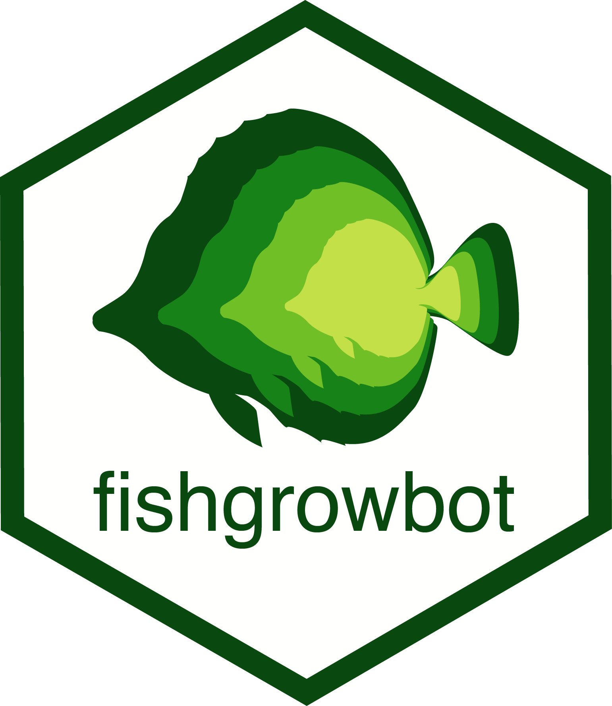

<!-- README.md is generated from README.Rmd. Please edit that file -->

fishgrowbot 
===================================================================================================================

Fish growth curves through back-calculation of otoliths rings in a Bayesian framework
-------------------------------------------------------------------------------------

<!-- badges: start -->

<!-- badges: end -->

The `fishgrowbot` package provides a tool to conduct back-calculation
based on otolith readings and fit the von Bertalanffy growth curve with
a hierarchical structure, both in a Bayesian framework.

It contains:

-   A function `bcalc()` to perform the back-calculations which yields
    length-at-age estimations with measures of uncertainty.

-   A function called `growthreg()` to fit the von Bertalanffy growth
    model.

-   Functions to visualize results.

Installing and loading fishgrowbot
----------------------------------

`fishgrowbot` uses Markov Chain Monte Carlo simulations provided by
[stan](https://github.com/stan-dev/rstan/wiki/RStan-Getting-Started).
Therefore, the first step is to install
[stan](https://github.com/stan-dev/rstan/wiki/RStan-Getting-Started).

### GitHub

The best way to install the latest version of `fishgrowbot` is to
install it from GitHub.

    install.packages("devtools")
    devtools::install_github("nschiett/fishgrowbot", dependencies = TRUE)
    library(fishgrowbot)

Usage
-----

See the package documentation and introduction vignette.

Further Information
-------------------

`fishgrowbot` is provided under the MIT License
([MIT](http://opensource.org/licenses/MIT)).

Citation
--------

    #> 
    #> To cite package 'fishgrowbot' in publications use:
    #> 
    #>   Nina M. D. Schiettekatte (2021). fishgrowbot: Fish Growth Curves Through
    #>   Back-Calculation of Otoliths Rings In A Bayesian Framework. R package version
    #>   0.0.0.9. https://nschiett.github.io/fishgrowbot
    #> 
    #> A BibTeX entry for LaTeX users is
    #> 
    #>   @Manual{,
    #>     title = {fishgrowbot: Fish Growth Curves Through Back-Calculation of Otoliths Rings In
    #> A Bayesian Framework},
    #>     author = {Nina M. D. Schiettekatte},
    #>     year = {2021},
    #>     note = {R package version 0.0.0.9},
    #>     url = {https://nschiett.github.io/fishgrowbot},
    #>   }
